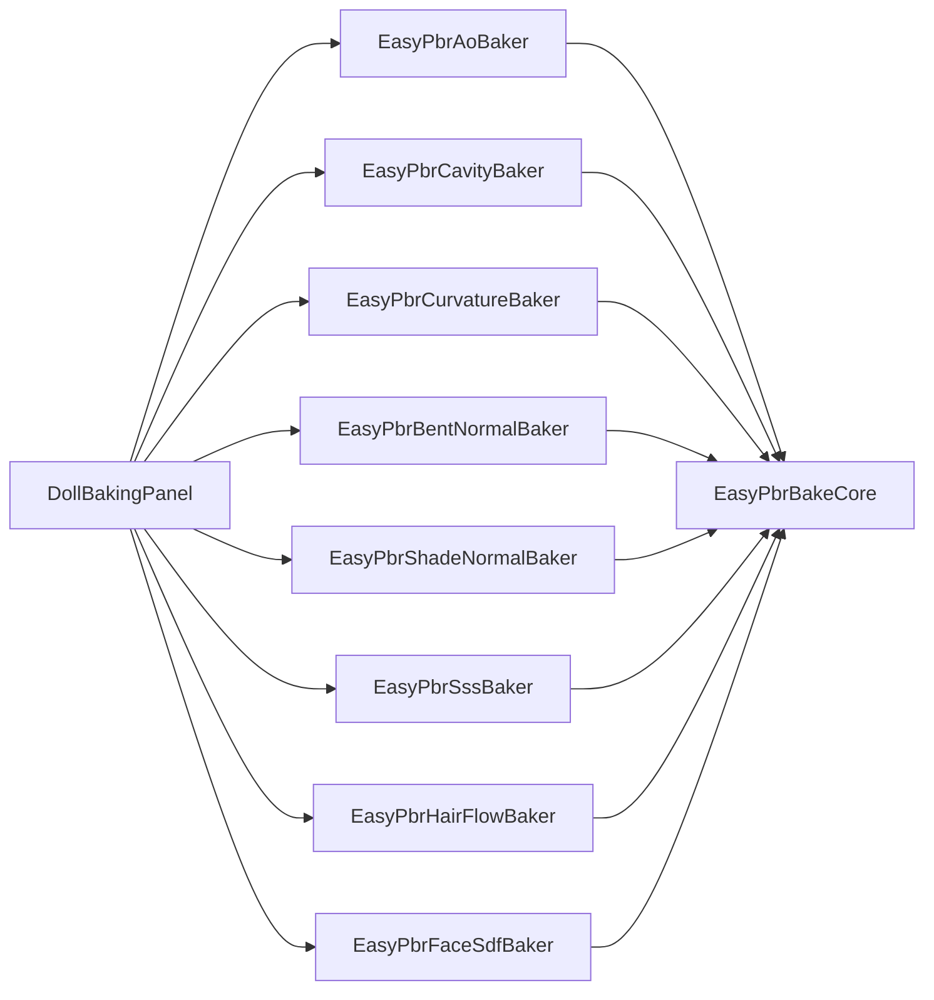

# EasyPBR for URP — アーキテクチャ

ライブラリの内部構成と技術的な設計方針を解説する。利用者向けの導入・パラメータ説明は [README](../README.md) を参照。

## レンダリング設計方針

シェーダーの描画における中核的なアプローチと仕様は以下の通り。

* **高品質セルフシャドウ（中核）**
  メインライト専用に、スクリーン空間回転 Vogel ディスクの PCF とブロッカー探索による PCSS（コンタクトハードニング）を実装。低解像度シャドウマップ由来のアクネ・ジャギーを発生源で除去し、顔のような曲面でも**マスクテクスチャ無しでクリーンな落ち影**を生成する。追加ライトの影は URP 標準のままにして多灯時の負荷を抑え、落ち影（Shadow map）と陰影（NdotL）は分離して合成する。
* **顔影（独立した調整軸）**
  「正しいが描きたくない」落ち影・陰を、マスクテクスチャ無しのプロシージャルマスクで正面/上向きの面に限って明るく戻す（逆光時は陰を維持）。アクネを消す Receiver Normal Bias とは目的が逆（誤った影 vs 正しい影）の別軸。Quality: Off 時の主要な調整手段となる。
* **スペキュラとマテリアルモデル**
  Dual-Lobe を基本とし、Specular Model で軽量な Blinn-Phong と物理ベースの GGX（Schlick Fresnel・Smith 可視性込みの Cook-Torrance）をパス内で切り替える。
* **ベイク済みコントロールマップ**
  DCC 不要の Editor ベイクで、陰影・反射・質感を補強するマップを焼く（AO / Cavity / 曲率 / ベント法線 / SSS / ヘアフロー / 顔 SDF）。いずれもランタイムは uniform 動的分岐で、未ベイク時はスキップ＝バリアント非増。
* **ブルーノイズの共通化**
  1 枚のテクスチャを、影エッジのディザリング（Self Shadow Mode: Off）とグレイン（法線の微細揺らぎ）で共通サンプルし、テクスチャフェッチを節約する。
* **SRP Batcher を意識した設計（基本思想）**
  3D ライブのように同種マテリアルを大量に同時描画する用途を前提に、**動的分岐にすると不利な処理だけをバリアントに残し、それ以外はバリアント化を避けてバッチ分断を最小化する**ことを設計方針としている。具体的には (1) 全マテリアルプロパティを単一 CBUFFER にまとめて SRP Batcher 互換を保つ、(2) マテリアル間で値が割れやすく動的化のデメリットが小さいスイッチ（Shading Style / Specular Model / Alpha Blend / MatCap / Emission / Color Correction）は keyword をやめて uniform 動的分岐にする、(3) **動的分岐にすると損するスイッチだけ** keyword として残す（Self Shadow Mode＝全経路コンパイルで occupancy 低下、Alpha Clip / Dissolve＝早期Z喪失や常時サンプル化）。Inspector では **⚡ マーク**で「バリアントを生む＝混在でバッチが切れる」ことを可視化する、(4) アウトラインは独自 LightMode（`DollOutline`）＋ RendererFeature に逃がし、ForwardLit と交互描画させない。詳細は [SRP_BATCHER](SRP_BATCHER.md) / [VARIANTS](VARIANTS.md)。

## パッケージ間依存

```
com.origuma.easyshader-core (共通基盤・>= 0.3.0)
    ↑                      ↑
com.origuma.easypbr-urp    com.origuma.easytoon-urp
（本パッケージ）
・HLSL: Packages/com.origuma.easyshader-core/Runtime/Shaders/Common/** を絶対パス include
・依存宣言は package.json に置かず、PM 追加直後（および起動時）に Installer が自動導入
  （UPM は git 依存を解決できないため。→ Editor/Installer/EasyShaderCoreInstaller.cs）
・本体 Editor asmdef（Origuma.EasyPBR.URP.Editor）は versionDefines + defineConstraints
  （シンボル EASYSHADERCORE_PRESENT）で Core 不在時にコンパイル対象から除外。コンパイル
  エラーでドメインリロードが止まらず、PM 追加直後に Installer が走れる（再起動不要でゼロクリック導入）
・C# Editor: asmdef 参照 Origuma.EasyShaderCore.Editor で Baker 群 (EasyPbr*Baker, public) /
  ShaderGuiKit を再利用
```

- **EasyPBR は `com.origuma.easyshader-core` のみに依存する**（EasyToon には依存しない。EasyToon 側は Doll→Idol 変換の変換対象としてのみ EasyPBR に触れ、コード依存はない）。
- **依存を package.json に宣言しない理由**: UPM は git 依存をレジストリ解決できず、宣言すると本パッケージ自体の git URL インストールが拒否される。代わりに `Editor/Installer/EasyShaderCoreInstaller.cs`（参照ゼロの独立 asmdef）が Core 不在を検知し、ピン留め URL `https://github.com/orig-uma/EasyShaderCore.git#v0.2.0` で自動導入する（失敗時のみ手動手順つきの案内ウィンドウ）。
- **asmdef 除外の意味**: Core 不在時に本体 Editor asmdef がコンパイルエラーを出すと Unity はドメインリロードを完了できず、PM 追加直後に `InitializeOnLoad` が走らない（＝再起動まで自動導入されない）。EASYSHADERCORE_PRESENT による除外でこれを回避する。
- **Common HLSL は「純粋関数のみ・特定シェーダー非依存」を維持する**（層の詳細は [汎用ライブラリ構成（Common）](#汎用ライブラリ構成common)）。`Doll` 固有の方針（陰ランプ・キーワード運用等）を core に入れるのは禁止。Baker の呼び出し面（`Bake(root, material, Settings)`）は互換維持。

## ライブラリの分離方針

切り分けの軸は **機能ではなく依存の方向**である。汎用ライブラリ（計算本体）を `Common/` に純粋関数として切り出し、`Doll` 固有の方針はポリシー層に集約することで、他シェーダーへの流用を容易にする。

### ディレクトリ構成

```text
Runtime/
  DollOutlineFeature.cs         アウトライン描画 RendererFeature（独自 LightMode "DollOutline"）
  Shaders/
    Doll/                       Doll シェーダー（流用しない固有実装）
      Doll.shader               Properties、Pass 定義
      DollInput.hlsl            共通変数・テクスチャ（CBUFFER）
      DollSurfaceTypes.hlsl     DollSurfaceData 構造体のみ（型定義）
      DollSurface.hlsl          サーフェス収集・後処理関数（実装。Varyings 定義後に include）
      DollEffects.hlsl          Dissolve / MatCap / Emission / SpecularOcclusion のポリシー層
      DollLighting.hlsl         ライティング統合のポリシー層（CalculateSingleLight を集約）
      DollShadows.hlsl          メインライト高品質セルフシャドウのラッパー
      Passes/
        ForwardPass.hlsl        ForwardLit パス（薄い骨組み）
        ShadowPass.hlsl         ShadowCaster パス
        DepthOnlyPass.hlsl      DepthOnly パス
        DepthNormalsPass.hlsl   DepthNormals パス
        OutlinePass.hlsl        Outline パス
    Common/                     汎用ライブラリ（流用する価値のある純粋関数）
      Common.hlsl               アンブレラ
      Common_Math.hlsl
      Common_Color.hlsl
      Common_Sampling.hlsl
      BRDF/
      Effects/
      URP/
  Compute/                      Dissolve エッジ算出 Compute Shader
  Scripts/                      Dissolve VFX 制御スクリプト（asmdef）
  VFX/                          Dissolve VFX Graph
  Textures/                     BlueNoise / Ramp / Dissolve ノイズ
Editor/
  DollShaderGUI.cs              カスタムインスペクター
  DollBakingPanel.cs            マップベイク UI（Baking セクション）
  DollOutlineSetupWindow.cs     Outline Feature の追加/削除 Window
  Baking/
    EasyPbrBakeCore.cs          共通パイプライン RunBake（最大 RGBA 4ch・チャンネル別 clearValue）
    EasyPbrAoBaker.cs           AO ベイク
    EasyPbrCavityBaker.cs       Cavity ベイク
    EasyPbrCurvatureBaker.cs    Curvature ベイク（符号付き曲率）
    EasyPbrBentNormalBaker.cs   Bent Normal ベイク（RGBA: 方向＋開き具合）
    EasyPbrShadeNormalBaker.cs  Shade Normal ベイク（位置溶接＋ラプラシアン平滑化）
    EasyPbrSssBaker.cs          SSS ベイク（RGBA: 透過方向＋厚み）
    EasyPbrHairFlowBaker.cs     Hair Flow ベイク（倍角エンコード＋信頼度）
    EasyPbrFaceSdfBaker.cs      Face SDF ベイク（RGBA 4ch）
```

## ファイル構成

| パス | 役割 |
| :--- | :--- |
| `Runtime/Shaders/Doll/Doll.shader` | Properties、Pass 定義 |
| `Runtime/Shaders/Doll/DollInput.hlsl` | 共通変数・テクスチャ（CBUFFER） |
| `Runtime/Shaders/Doll/DollSurfaceTypes.hlsl` | `DollSurfaceData` 構造体のみ。URP `Lighting.hlsl` の `SurfaceData` と衝突しないよう独自名。`DollLighting` はこの型定義のみを include |
| `Runtime/Shaders/Doll/DollSurface.hlsl` | サーフェス収集・後処理関数の実装（`DOLL_SURFACE_IMPL` ガード）。`Varyings` 定義後に include する |
| `Runtime/Shaders/Doll/DollEffects.hlsl` | Dissolve / MatCap / Emission / `SpecularOcclusion`（Lagarde/Frostbite）のポリシー層。計算本体は `Common/` へ委譲 |
| `Runtime/Shaders/Doll/DollLighting.hlsl` | ライティング統合のポリシー層。`CalculateSingleLight`（1 灯ぶんの陰影・スペキュラ・SSS・リム・ファズ・異方性・グリッター・コート直接光）を集約。計算本体は `Common/` へ委譲 |
| `Runtime/Shaders/Doll/DollShadows.hlsl` | メインライト高品質セルフシャドウのラッパー（PCF / PCSS）。実装は `Common/URP/Shadow_HQ_URP.hlsl` |
| `Runtime/Shaders/Doll/Passes/ForwardPass.hlsl` | ForwardLit パス（骨組み。下記参照） |
| `Runtime/Shaders/Doll/Passes/ShadowPass.hlsl` | ShadowCaster パス |
| `Runtime/Shaders/Doll/Passes/DepthOnlyPass.hlsl` | DepthOnly パス |
| `Runtime/Shaders/Doll/Passes/DepthNormalsPass.hlsl` | DepthNormals パス |
| `Runtime/Shaders/Doll/Passes/OutlinePass.hlsl` | Outline パス（LightMode = `DollOutline`） |
| `Runtime/DollOutlineFeature.cs` | `DollOutline` パスを後段でまとめて描く RendererFeature（ForwardLit のバッチング維持） |
| `Runtime/Scripts/DollLiveDirector.cs` | 演出系プロパティ（Black Out / Fill Light）のキャラ単位一括制御。Play=マテリアルインスタンス（SRP Batcher 維持）/ Edit=非破壊 MPB プレビュー。Dissolve 制御は EasyShaderCore の `DissolveController` へ移管 |
| `Runtime/Shaders/Common/` | キーワード・マテリアルプロパティに非依存の汎用ライブラリ（後述） |
| `Editor/DollShaderGUI.cs` | カスタムインスペクター |
| `Editor/DollBakingPanel.cs` | マップベイク UI（`DollShaderGUI` の Baking セクション） |
| `Editor/Baking/EasyPbrBakeCore.cs` | ベイク共通パイプライン `RunBake` |
| `Editor/Baking/EasyPbrAoBaker.cs` | Ambient Occlusion → `_OcclusionMap` |
| `Editor/Baking/EasyPbrCavityBaker.cs` | Cavity → `_CavityMap` |
| `Editor/Baking/EasyPbrCurvatureBaker.cs` | Curvature → `_CurvatureMap` |
| `Editor/Baking/EasyPbrBentNormalBaker.cs` | Bent Normal → `_BentNormalMap`（RGBA） |
| `Editor/Baking/EasyPbrShadeNormalBaker.cs` | Shade Normal → `_ShadeNormalMap`（接線空間。位置溶接＋ラプラシアン平滑化・レイ不要） |
| `Editor/Baking/EasyPbrSssBaker.cs` | SSS → `_SSSMap`（RGBA） |
| `Editor/Baking/EasyPbrHairFlowBaker.cs` | Hair Flow → `_HairFlowMap` |
| `Editor/Baking/EasyPbrFaceSdfBaker.cs` | Face SDF → `_FaceSDFMap`（RGBA 4ch） |

## ForwardLit パスの構成（サーフェス層）

`ForwardPass.hlsl` の frag は責務分割され、薄い骨組みになっている（処理本体は `DollSurface.hlsl` / `DollLighting.hlsl`）。挙動は分割前と不変。

```text
GatherSurface()           ← テクスチャサンプル・デコード一式（ビュー/ライト非依存）
  → メインライト取得・シャドウ
  → ComputeFaceSDF()      ← 顔 SDF シャドウ
  → CalculateSingleLight()＋クリアコート直接光（メインライト）
  → 追加ライトループ（CalculateSingleLight）
  → ApplyEnvironmentAndCoat()  ← 環境反射＋クリアコート反射（cube フェッチ 1 回共有）
  → ApplyPostEffects()         ← MatCap / Emission / Dissolve / BlackOut
```

* **`DollSurfaceData`**（`DollSurfaceTypes.hlsl`）: アルベド（`albedo` / `shadowAlbedo`・`shadow2Albedo`＝Shadow Color / 2nd Shadow Color と Hue Shift/Saturation を適用済みの 1影・2影の最終色。ライト非依存に 1 回だけ算出し per-light の再計算を排除）・各種法線（clean / detail / bent / coat）・各マスク（receiveShadow / spec / occlusion / cavity / curvRidge / clearcoat）・SSS（透過方向 / 厚み）・bent openness・ビュー依存の前計算（NdotV / fresnel / AnisoPrecomp / GlitterGeom）・`indirectLight`（`SampleSH(bentNormalWS)` に Flatten / Intensity / Tint の整形を適用済み）等をまとめた構造体。型名を `DollSurfaceData` としているのは URP `Lighting.hlsl` の `SurfaceData` との衝突回避のため。
* **`CalculateSingleLight`**（`DollLighting.hlsl`）: 引数を `DollSurfaceData` で受ける形に集約（旧来の 20 引数超を解消）。追加ライトは `indirectLight=0, sdfLit=-1, sdfMask=1` を渡す。
* **環境反射の 1 フェッチ共有**: `ApplyEnvironmentAndCoat` は `EasyPBR_SampleEnvironment` を **1 回**だけ呼び、下地反射（`_SpecularF0` のフレネル＋スペキュラ遮蔽）とクリアコート反射（F0=0.04 のフレネル＋イリデッセンス＋マスク）で重みだけ別々に適用する。下地反射の挙動は分割前と同一。コート反射は同一の反射ベクトル・mip を共有する（コート専用に別 mip を引かない軽量化）。
* **include 設計**: `DollLighting` は `DollSurfaceTypes.hlsl`（型のみ）を include。`DollSurface.hlsl`（実装）は `Varyings` 定義後に `#define DOLL_SURFACE_IMPL` してから include する。Unity は include パス文字列でファイルを識別するため、`DollSurfaceTypes` は 1 箇所からのみ include して二重定義を避ける。

## ベイク（Editor / Map Generator）

DCC 不要でメッシュからデータマップを生成する **Editor 専用**ツール。ランタイムアセンブリ・シェーダーバリアントには影響しない。UI は `DollBakingPanel`、計算本体は `Editor/Baking/` 配下の Baker 群。

### クラス構成



各 Baker は `Settings` / `Default` / `Bake(...)` の同一 API。マップ固有の頂点計算だけを Baker 内に閉じ、保存・ラスタライズ・後処理は `EasyPbrBakeCore.RunBake` に委譲する。

### 共通パイプライン（RunBake）

1. **Root 配下**で編集中マテリアルを使う `MeshRenderer` / `SkinnedMeshRenderer` を収集
2. SkinnedMesh は現在ポーズを `BakeMesh` で一時メッシュ化（Read/Write 必須）
3. レイ遮蔽が必要な Baker（AO / Bent Normal / SSS / Face SDF）は全パーツに一時 `MeshCollider` を立て、遮蔽源とする（レイヤ 31 で隔離）
4. Renderer ごとに頂点値を計算 → 頂点平滑化 → **対象サブメッシュのみ** UV 空間へ CPU ラスタライズ（複数メッシュを 1 枚に累積）
5. Dilate → Blur → PNG 保存（Linear・無圧縮）→ マテリアル隣 `Baked/` へ出力し該当スロットへ自動アサイン（同名ファイルは上書き・GUID 維持）

1 マテリアルを複数メッシュで共有していても 1 テクスチャに焼ける。Strength / Intensity 等が 0 のときはベイク成功時に 1 へ自動有効化する。

`RunBake` は最大 **RGBA 4 チャンネル**のデリゲート（`computeR` / `computeG` / `computeB` / `computeA`）を受け取る。未指定チャンネルの背景は既定で白（1.0）だが、**チャンネル別クリア値**（`clearValueG` / `clearValueB` / `clearValueA`）を指定でき、接線空間マップ等で背景を neutral（例: RGB=(0.5,0.5,1)=幾何法線、A=0）にできる。

### マップ別 Baker

| Baker | 出力 suffix | マテリアルスロット | Collider | 概要 |
| :--- | :--- | :--- | :---: | :--- |
| `EasyPbrAoBaker` | AO | `_OcclusionMap` | 要 | 半球レイ遮蔽率 |
| `EasyPbrCavityBaker` | Cavity | `_CavityMap` | 不要 | 隣接頂点の凹み（レイ不要） |
| `EasyPbrCurvatureBaker` | Curvature | `_CurvatureMap` | 不要 | 符号付き曲率（0.5=平坦/明=凸/暗=凹、レイ不要） |
| `EasyPbrBentNormalBaker` | BentNormal | `_BentNormalMap` | 要 | RGB=接線空間ベント法線 / A=開き具合 |
| `EasyPbrSssBaker` | SSS | `_SSSMap` | 要 | RGB=接線空間透過方向 / A=厚み |
| `EasyPbrHairFlowBaker` | HairFlow | `_HairFlowMap` | 不要 | RG=毛流れ軸（倍角）/ B=信頼度 |
| `EasyPbrFaceSdfBaker` | FaceSDF | `_FaceSDFMap` | 要 | 顔 SDF（4ch・下記） |

### 方向系マップの符号化（共通方針）

ベント法線・SSS 透過方向は**接線空間**で焼く。ランタイムの TBN で再解釈されるためスキン変形に追従し、UV 接線が目的方向とずれていても「そのフレーム内での補正」を復元できる。ヘアフローは向きの無い軸（180°対称）なので、補間・ブラー・ミラーで打ち消し合わないよう**倍角（cos2θ, sin2θ）**で焼き、信頼度の低い箇所はランタイムで UV 接線へフォールバックする。

### Face SDF（RGBA 4 チャンネル）

ベイク（`EasyPbrFaceSdfBaker`）: 各頂点で **正面（`transform.forward`、Flip Forward で反転可）** から指定ローカル軸方向へ 180° スイープし、光が当たる→影に入る境界角度を 0..1 で記録。Cast Shadow ON 時は鼻・眉などの落ち影をレイで考慮。

**X Axis Tilt**（`Settings.xAxisTilt`・度）は R/G のスイープ軸を顔 Up 方向へ倒し、左右チャンネルを「やや上から差す光」として焼くベイク時オプション（既定 0＝水平）。左右とも同じ「上」へ倒すため左右対称は保たれ、傾けた軸は Forward と直交のまま＝格納値の意味（`cosθ*0.5+0.5`）が変わらないためランタイム側の変更は不要。B/A は対象外。

| チャンネル | スイープ軸（ローカル） | 意味 |
| :--- | :--- | :--- |
| **R** | +X（右） | 右側からの光 |
| **G** | -X（左） | 左側からの光 |
| **B** | +Y（上） | 上からの光 |
| **A** | -Y（下） | 下からの光 |

ランタイム（`ForwardPass.hlsl` → `ComputeFaceSDF`）: メインライト方向を顔ローカル（Forward / Up / Right）へ投影し、右・左・上・下各方向の **ウェイト付き平均**で 4 チャンネルを合成した SDF 値を得る。`frontness`（正面成分）と比較して顔影を生成。UV ミラー不要で **左右非対称の顔**（傷・マーク等）にも対応。ウェイトは Forward 軸まわりの方位だけで決まり、光が軸上（真正面・真後ろ）を通ると退化するため、軸から約 14.5° 以内では 4 チャンネルの平均へフェードして連続化している。詳細は [SHADOWS](SHADOWS.md) の Face SDF 節。

## Pass / LightMode

| Pass | LightMode | 用途 |
| :--- | :--- | :--- |
| ForwardLit | UniversalForward | メイン描画 |
| ShadowCaster | ShadowCaster | 落ち影の生成 |
| DepthOnly | DepthOnly | Depth Prepass / Depth Priming、Forward+ の深度生成 |
| DepthNormals | DepthNormals | Forward+ の Depth Normals Prepass、SSAO / Decal 用の法線生成 |
| Outline | DollOutline | 輪郭線（描画には `DollOutlineFeature` が必要 → [OUTLINE](OUTLINE.md)） |

> Outline は独自 LightMode タグ `DollOutline` を使い、URP の既定不透明描画に含まれない。これにより ForwardLit と交互描画されず ForwardLit のバッチングを阻害しない。各パスのキーワード・バリアントは [VARIANTS](VARIANTS.md)。

## 汎用ライブラリ構成（Common）

`Runtime/Shaders/Common/` に、計算本体を純粋関数として切り出している。
`Doll` 固有の方針はポリシー層（`DollEffects` / `DollLighting` / `DollShadows` / `DollSurface`）に集約する。

* **層の分離**

  | 層 | 役割 | 含むもの |
  | :--- | :--- | :--- |
  | Common（純粋） | 外部依存なし。入力 → 出力のみ | 数学・色・BRDF・エフェクトの計算本体 |
  | URP（結合） | URP のシャドウ／プローブグローバルに依存 | 高品質セルフシャドウサンプラ、環境反射サンプラ |
  | ポリシー（薄い） | キーワード / プロパティ / キャラ方針 | サーフェス収集、顔マスク、キーワード分岐、互換ラッパー |

* **互換性**
  公開関数名（`GetCastShadow` / `GetLitMask` / `CalculateDualLobeSpecular` / `SampleMainShadowHQ` / `ApplyDissolveClip` / `CalculateSSS` 等）と挙動は維持する。

### Common のファイル

| パス | 役割 |
| :--- | :--- |
| `Common/Common.hlsl` | アンブレラ。これ 1 本で BRDF / Effects の純粋関数を依存順に内包 |
| `Common/Common_Math.hlsl` | `Hash21`、`IGN`、`EasyPBR_Remap`、`Luminance601`、`ApplyLuminanceClamp` |
| `Common/Common_Color.hlsl` | `RgbToHsv`、`HsvToRgb`、`HueToRGB`、`ApplyColorCorrection`、`ConditionLightColor`（ライト色の影響度・彩度上限・輝度下限の整形） |
| `Common/Common_Sampling.hlsl` | `VogelDisk` |
| `Common/BRDF/BRDF_GGX.hlsl` | `D_GGX`、`V_SmithGGX`、`F_Schlick`、`GGXLobe`、`BlinnPhongLobe`、`ComputeSpecularAAVariance` / `ApplySpecularAA` |
| `Common/BRDF/BRDF_Specular.hlsl` | `DualLobeSpecularGGX` / `DualLobeSpecularBlinn` |
| `Common/BRDF/BRDF_Diffuse.hlsl` | `HalfLambert`、`ToonRamp`、`ShadeRamp`、`ShadedAlbedo`、`ApplyTerminatorScatter`（明暗境界の散乱にじみ）、`ResolveCastShadow` |
| `Common/BRDF/BRDF_RimFuzz.hlsl` | `GetFresnelTerms`、`CalculateRimLight`、`CalculatePeachFuzz` |
| `Common/BRDF/BRDF_Translucency.hlsl` | `CalculateSSS`（透過方向 `sssTransWS` で歪み軸を駆動） |
| `Common/BRDF/BRDF_Anisotropic.hlsl` | `AnisoPrecomp`、`PrecomputeAnisoTangent`（ヘアフロー倍角を統合）、`CalculateAnisotropicSpecular` |
| `Common/BRDF/BRDF_Clearcoat.hlsl` | `IridescenceTint`、`ClearcoatIridescence`、`CalculateClearcoat`（加算専用のコート＋薄膜虹色） |
| `Common/BRDF/BRDF_Glitter.hlsl` | `GlitterGeom`、`PrepareGlitter`、`ApplyGlitterLight` |
| `Common/BRDF/BRDF_Detail.hlsl` | `GetGrainNormal` |
| `Common/Effects/Fx_MatCap.hlsl` | `GetMatCapUV`、`GetMatCapUVLightAligned`（ライト連動）、`ApplyMatCap` |
| `Common/Effects/Fx_Emission.hlsl` | `CalculateEmission` |
| `Common/Effects/Fx_Dissolve.hlsl` | `ResolveDissolve`（`DissolveInput` 構造体・サンプリングは外部） |
| `Common/URP/Shadow_HQ_URP.hlsl` | `EasyPBR_SampleMainShadowHQ`、`EasyPBR_FindBlocker` |
| `Common/URP/Reflection_URP.hlsl` | `EasyPBR_SampleEnvironment`（生フェッチ）、`EasyPBR_EnvironmentReflection`（フレネル適用）。1 フェッチを下地・コートで共有する基盤 |
### include 順

```
URP Core.hlsl          ← 必ず最初（PI / TWO_PI / SafeNormalize / UNITY_* を供給）
  └─ Common.hlsl       （Common_* → BRDF_* → Effects_* を依存順に内包）
  └─ DollSurfaceTypes.hlsl  （DollSurfaceData 型のみ）
  └─ DollLighting.hlsl      （Common.hlsl + DollSurfaceTypes を内部 include）
  └─ DollEffects.hlsl       （Common_Color + Effects を内部 include）
URP Shadows.hlsl
  └─ DollShadows.hlsl       （Common/URP/Shadow_HQ_URP.hlsl を内部 include）
（各 Pass）
  └─ Varyings 定義後に #define DOLL_SURFACE_IMPL → DollSurface.hlsl
```
