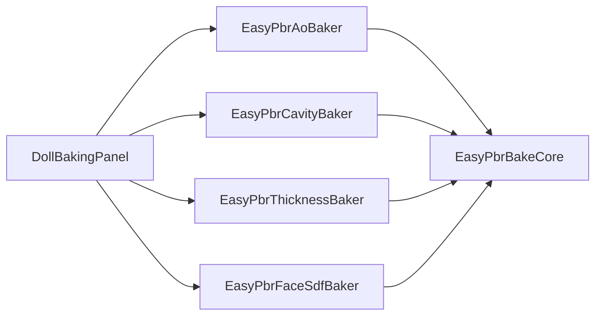

# EasyPBR for URP — アーキテクチャ

ライブラリの内部構成と技術的な設計方針を解説する。利用者向けの導入・パラメータ説明は [README](../README.md) を参照。

## レンダリング設計方針

シェーダーの描画における中核的なアプローチと仕様は以下の通り。

* **高品質セルフシャドウ（中核）**
  メインライト専用に、スクリーン空間回転 Vogel ディスクの PCF とブロッカー探索による PCSS（コンタクトハードニング）を実装。低解像度シャドウマップ由来のアクネ・ジャギーを発生源で除去し、顔のような曲面でも**マスクテクスチャ無しでクリーンな落ち影**を生成する。追加ライトの影は URP 標準のままにして多灯時の負荷を抑え、落ち影（Shadow map）と陰影（NdotL）は分離して合成する。
* **顔影（独立した調整軸）**
  「正しいが描きたくない」落ち影・陰を、マスクテクスチャ無しのプロシージャルマスクで正面/上向きの面に限って明るく戻す（逆光時は陰を維持）。アクネを消す Receiver Normal Bias とは目的が逆（誤った影 vs 正しい影）の別軸。Quality: Off 時の主要な調整手段となる。
* **スペキュラとマテリアルモデル**
  Dual-Lobe を基本とし、Specular Model で軽量な Blinn-Phong と物理ベースの GGX（Schlick Fresnel・Smith 可視性込みの Cook-Torrance）をパス内で切り替える。
* **ブルーノイズの共通化**
  1 枚のテクスチャを、影エッジのディザリング（Self Shadow Mode: Off）とグレイン（法線の微細揺らぎ）で共通サンプルし、テクスチャフェッチを節約する。
* **SRP Batcher を意識した設計（基本思想）**
  3D ライブのように同種マテリアルを大量に同時描画する用途を前提に、**動的分岐にすると不利な処理だけをバリアントに残し、それ以外はバリアント化を避けてバッチ分断を最小化する**ことを設計方針としている。具体的には (1) 全マテリアルプロパティを単一 CBUFFER にまとめて SRP Batcher 互換を保つ、(2) マテリアル間で値が割れやすく動的化のデメリットが小さいスイッチ（Shading Style / Specular Model / Alpha Blend / MatCap / Emission / Color Correction）は keyword をやめて uniform 動的分岐にする、(3) **動的分岐にすると損するスイッチだけ** keyword として残す（Self Shadow Mode＝全経路コンパイルで occupancy 低下、Alpha Clip / Dissolve＝早期Z喪失や常時サンプル化）。Inspector では **⚡ マーク**で「バリアントを生む＝混在でバッチが切れる」ことを可視化する、(4) アウトラインは独自 LightMode（`DollOutline`）＋ RendererFeature に逃がし、ForwardLit と交互描画させない。詳細は [SRP_BATCHER](SRP_BATCHER.md) / [VARIANTS](VARIANTS.md)。

## ライブラリの分離方針
a
切り分けの軸は **機能ではなく依存の方向**である。汎用ライブラリ（計算本体）を `Common/` に純粋関数として切り出し、`Doll` 固有の方針はポリシー層に集約することで、他シェーダーへの流用を容易にする。

### ディレクトリ構成

```text
Runtime/
  DollOutlineFeature.cs         アウトライン描画 RendererFeature（独自 LightMode "DollOutline"）
  Shaders/
    Doll/                       Doll シェーダー（流用しない固有実装）
      Doll.shader               Properties、Pass 定義
      DollInput.hlsl            共通変数・テクスチャ（CBUFFER）
      DollEffects.hlsl          Dissolve / MatCap / Emission のポリシー層
      DollLighting.hlsl         ライティング統合のポリシー層
      DollShadows.hlsl          メインライト高品質セルフシャドウのラッパー
      Passes/
        ForwardPass.hlsl        ForwardLit パス
        ShadowPass.hlsl         ShadowCaster パス
        DepthOnlyPass.hlsl      DepthOnly パス
        DepthNormalsPass.hlsl   DepthNormals パス
        OutlinePass.hlsl        Outline パス
    Common/                     汎用ライブラリ（流用する価値のある純粋関数）
      Common.hlsl               アンブレラ
      Common_Math.hlsl
      Common_Color.hlsl
      Common_Sampling.hlsl
      BRDF/
      Effects/
      URP/
  Compute/                      Dissolve エッジ算出 Compute Shader
  Scripts/                      Dissolve VFX 制御スクリプト（asmdef）
  VFX/                          Dissolve VFX Graph
  Textures/                     BlueNoise / Ramp / Dissolve ノイズ
Editor/
  DollShaderGUI.cs              カスタムインスペクター
  DollBakingPanel.cs            マップベイク UI（Baking セクション）
  DollOutlineSetupWindow.cs     Outline Feature の追加/削除 Window
  Baking/
    EasyPbrBakeCore.cs          共通パイプライン RunBake（最大 RGBA 4ch）
    EasyPbrAoBaker.cs           AO ベイク
    EasyPbrCavityBaker.cs       Cavity ベイク
    EasyPbrThicknessBaker.cs    Thickness (SSS) ベイク
    EasyPbrFaceSdfBaker.cs      Face SDF ベイク（RGBA 4ch）
```

## ファイル構成

| パス | 役割 |
| :--- | :--- |
| `Runtime/Shaders/Doll/Doll.shader` | Properties、Pass 定義 |
| `Runtime/Shaders/Doll/DollInput.hlsl` | 共通変数・テクスチャ（CBUFFER） |
| `Runtime/Shaders/Doll/DollEffects.hlsl` | Dissolve / MatCap / Emission のポリシー層（薄いラッパー）。計算本体は `Common/` へ委譲 |
| `Runtime/Shaders/Doll/DollLighting.hlsl` | ライティング統合のポリシー層（顔影、Toon / Specular / Shadow のキーワード解決、互換ラッパー）。計算本体は `Common/` へ委譲 |
| `Runtime/Shaders/Doll/DollShadows.hlsl` | メインライト高品質セルフシャドウのラッパー（PCF / PCSS）。実装は `Common/URP/Shadow_HQ_URP.hlsl` |
| `Runtime/Shaders/Doll/Passes/ForwardPass.hlsl` | ForwardLit パス |
| `Runtime/Shaders/Doll/Passes/ShadowPass.hlsl` | ShadowCaster パス |
| `Runtime/Shaders/Doll/Passes/DepthOnlyPass.hlsl` | DepthOnly パス |
| `Runtime/Shaders/Doll/Passes/DepthNormalsPass.hlsl` | DepthNormals パス |
| `Runtime/Shaders/Doll/Passes/OutlinePass.hlsl` | Outline パス（LightMode = `DollOutline`） |
| `Runtime/DollOutlineFeature.cs` | `DollOutline` パスを後段でまとめて描く RendererFeature（ForwardLit のバッチング維持） |
| `Runtime/Shaders/Common/` | キーワード・マテリアルプロパティに非依存の汎用ライブラリ（後述） |
| `Runtime/Textures/BlueNoise_RGB_256.png` | Grain / Shadow Dither 用 |
| `Runtime/Textures/DissolveNoise.png` | Dissolve ノイズ |
| `Editor/DollShaderGUI.cs` | カスタムインスペクター |
| `Editor/DollBakingPanel.cs` | マップベイク UI（`DollShaderGUI` の Baking セクション） |
| `Editor/Baking/EasyPbrBakeCore.cs` | ベイク共通パイプライン `RunBake` |
| `Editor/Baking/EasyPbrAoBaker.cs` | Ambient Occlusion → `_OcclusionMap` |
| `Editor/Baking/EasyPbrCavityBaker.cs` | Cavity → `_CavityMap` |
| `Editor/Baking/EasyPbrThicknessBaker.cs` | Thickness → `_SSSMask` |
| `Editor/Baking/EasyPbrFaceSdfBaker.cs` | Face SDF → `_FaceSDFMap`（RGBA 4ch） |

## ベイク（Editor / Map Generator）

DCC 不要でメッシュからデータマップを生成する **Editor 専用**ツール。ランタイムアセンブリ・シェーダーバリアントには影響しない。UI は `DollBakingPanel`、計算本体は `Editor/Baking/` 配下の Baker 群。

### クラス構成



各 Baker は `Settings` / `Default` / `Bake(root, material, settings)` の同一 API。マップ固有の頂点計算だけを Baker 内に閉じ、保存・ラスタライズ・後処理は `EasyPbrBakeCore.RunBake` に委譲する。

### 共通パイプライン（RunBake）

1. **Root 配下**で編集中マテリアルを使う `MeshRenderer` / `SkinnedMeshRenderer` を収集
2. SkinnedMesh は現在ポーズを `BakeMesh` で一時メッシュ化（Read/Write 必須）
3. レイ遮蔽が必要な Baker（AO / Face SDF / Thickness）は全パーツに一時 `MeshCollider` を立て、遮蔽源とする（レイヤ 31 で隔離）
4. Renderer ごとに頂点スカラを計算 → 頂点平滑化 → **対象サブメッシュのみ** UV 空間へ CPU ラスタライズ（複数メッシュを 1 枚に累積）
5. Dilate → Blur → PNG 保存（Linear・無圧縮）→ マテリアル隣 `Baked/` へ出力し該当スロットへ自動アサイン

1 マテリアルを複数メッシュで共有していても 1 テクスチャに焼ける。Strength / Intensity 等が 0 のときはベイク成功時に 1 へ自動有効化する。

`RunBake` は最大 **RGBA 4 チャンネル**のデリゲート（`computeR` / `computeG` / `computeB` / `computeA`）を受け取る。未指定チャンネルは白（1.0）のまま。

### マップ別 Baker

| Baker | 出力 suffix | マテリアルスロット | Collider | 概要 |
| :--- | :--- | :--- | :---: | :--- |
| `EasyPbrAoBaker` | AO | `_OcclusionMap` | 要 | 半球レイ遮蔽率 |
| `EasyPbrCavityBaker` | Cavity | `_CavityMap` | 不要 | 隣接頂点の凹み（レイ不要） |
| `EasyPbrThicknessBaker` | Thickness | `_SSSMask` | 要 | 内向きレイで厚み（薄い＝白） |
| `EasyPbrFaceSdfBaker` | FaceSDF | `_FaceSDFMap` | 要 | 顔 SDF（下記 4ch） |

### Face SDF（RGBA 4 チャンネル）

ベイク（`EasyPbrFaceSdfBaker`）: 各頂点で **正面（`transform.forward`、Flip Forward で反転可）** から指定ローカル軸方向へ 180° スイープし、光が当たる→影に入る境界角度を 0..1 で記録。Cast Shadow ON 時は鼻・眉などの落ち影をレイで考慮。

| チャンネル | スイープ軸（ローカル） | 意味 |
| :--- | :--- | :--- |
| **R** | +X（右） | 右側からの光 |
| **G** | -X（左） | 左側からの光 |
| **B** | +Y（上） | 上からの光 |
| **A** | -Y（下） | 下からの光 |

ランタイム（`ForwardPass.hlsl`）: メインライト方向を顔ローカル（Forward / Up / Right）へ投影し、右・左・上・下各方向の **ウェイト付き平均**で 4 チャンネルを合成した SDF 値を得る。`frontness`（正面成分）と比較して顔影を生成。UV ミラー不要で **左右非対称の顔**（傷・マーク等）にも対応。詳細は [SHADOWS](SHADOWS.md) の Face SDF 節。

## Pass / LightMode

| Pass | LightMode | 用途 |
| :--- | :--- | :--- |
| ForwardLit | UniversalForward | メイン描画 |
| ShadowCaster | ShadowCaster | 落ち影の生成 |
| DepthOnly | DepthOnly | Depth Prepass / Depth Priming、Forward+ の深度生成 |
| DepthNormals | DepthNormals | Forward+ の Depth Normals Prepass、SSAO / Decal 用の法線生成 |
| Outline | DollOutline | 輪郭線（描画には `DollOutlineFeature` が必要 → [OUTLINE](OUTLINE.md)） |

> Outline は独自 LightMode タグ `DollOutline` を使い、URP の既定不透明描画に含まれない。これにより ForwardLit と交互描画されず ForwardLit のバッチングを阻害しない。各パスのキーワード・バリアントは [VARIANTS](VARIANTS.md)。

## 汎用ライブラリ構成（Common）

`Runtime/Shaders/Common/` に、計算本体を純粋関数として切り出している。
`Doll` 固有の方針はポリシー層（`DollEffects` / `DollLighting` / `DollShadows`）に集約する。

* **層の分離**

  | 層 | 役割 | 含むもの |
  | :--- | :--- | :--- |
  | Common（純粋） | 外部依存なし。入力 → 出力のみ | 数学・色・BRDF・エフェクトの計算本体 |
  | URP（結合） | URP のシャドウグローバルに依存 | 高品質セルフシャドウサンプラ |
  | ポリシー（薄い） | キーワード / プロパティ / キャラ方針 | 顔マスク、キーワード分岐、互換ラッパー |

* **汎用化方針**
  キーワード（`_SHADOWMODE_*` 等）は `bool` 引数化、マテリアルプロパティ（`_ReceiverNormalBias` / `_Dissolve*` 等）と Dissolve のテクスチャサンプリングは呼び出し側へ外出しする。`Doll_` 接頭辞は除去する。
  なお Shading Style / Specular Model は keyword を持たず、`_ShadingStyle` / `_SpecularModel`（uniform）の `UNITY_BRANCH` 動的分岐で解決する（混在マテリアルの SRP Batcher バッチング維持のため。0.3.5）。
* **互換性**
  公開関数名（`GetCastShadow` / `GetLitMask` / `CalculateDualLobeSpecular` / `SampleMainShadowHQ` / `ApplyDissolveClip` 等）と挙動は維持する。各パスのフラグメント側は無改修で動作する。

### Common のファイル

| パス | 役割 |
| :--- | :--- |
| `Common/Common.hlsl` | アンブレラ。これ 1 本で BRDF / Effects の純粋関数を依存順に内包 |
| `Common/Common_Math.hlsl` | `Hash21`、`IGN`、`EasyPBR_Remap`、`Luminance601`、`ApplyLuminanceClamp` |
| `Common/Common_Color.hlsl` | `RgbToHsv`、`HsvToRgb`、`HueToRGB`、`ApplyColorCorrection` |
| `Common/Common_Sampling.hlsl` | `VogelDisk` |
| `Common/BRDF/BRDF_GGX.hlsl` | `D_GGX`、`V_SmithGGX`、`F_Schlick`、`GGXLobe`、`BlinnPhongLobe`、`ComputeSpecularAAVariance` / `ApplySpecularAA`（Geometric Specular AA） |
| `Common/BRDF/BRDF_Specular.hlsl` | `DualLobeSpecularGGX` / `DualLobeSpecularBlinn` |
| `Common/BRDF/BRDF_Diffuse.hlsl` | `HalfLambert`、`ToonRamp`、`ShadeRamp`、`ShadedAlbedo`、`ResolveCastShadow` |
| `Common/BRDF/BRDF_RimFuzz.hlsl` | `GetFresnelTerms`、`CalculateRimLight`、`CalculatePeachFuzz` |
| `Common/BRDF/BRDF_Translucency.hlsl` | `CalculateSSS` |
| `Common/BRDF/BRDF_Anisotropic.hlsl` | `AnisoPrecomp`、`PrecomputeAnisoTangent`、`CalculateAnisotropicSpecular` |
| `Common/BRDF/BRDF_Glitter.hlsl` | `GlitterGeom`、`PrepareGlitter`、`ApplyGlitterLight` |
| `Common/BRDF/BRDF_Detail.hlsl` | `GetGrainNormal` |
| `Common/Effects/Fx_MatCap.hlsl` | `GetMatCapUV`、`GetMatCapUVLightAligned`（ライト連動）、`ApplyMatCap` |
| `Common/Effects/Fx_Emission.hlsl` | `CalculateEmission` |
| `Common/Effects/Fx_Dissolve.hlsl` | `ResolveDissolve`（`DissolveInput` 構造体・サンプリングは外部） |
| `Common/URP/Shadow_HQ_URP.hlsl` | `EasyPBR_SampleMainShadowHQ`、`EasyPBR_FindBlocker` |
| `Common/URP/Reflection_URP.hlsl` | `EasyPBR_SampleEnvironment`、`EasyPBR_EnvironmentReflection`（Reflection Probe 反射） |

### include 順

```
URP Core.hlsl          ← 必ず最初（PI / TWO_PI / SafeNormalize / UNITY_* を供給）
  └─ Common.hlsl       （Common_* → BRDF_* → Effects_* を依存順に内包）
  └─ DollLighting.hlsl      （Common.hlsl を内部 include）
  └─ DollEffects.hlsl       （Common_Color + Effects を内部 include）
URP Shadows.hlsl
  └─ DollShadows.hlsl       （Common/URP/Shadow_HQ_URP.hlsl を内部 include）
````
