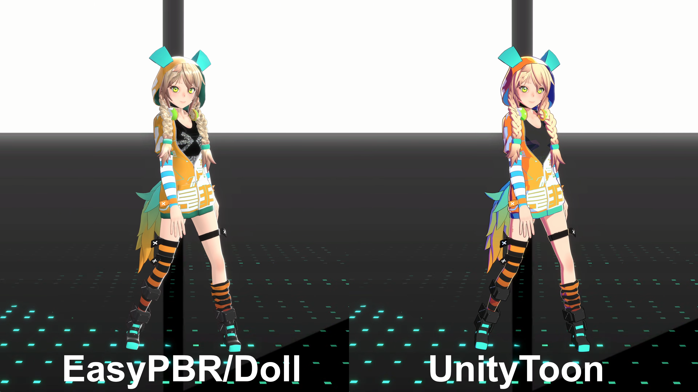

# EasyPBR for URP

[](https://www.youtube.com/watch?v=o3b8NkF3lj4)

*▶ 画像をクリックするとYouTubeでデモ動画（Showcase）をご覧いただけます*

> **Demo Video Credits**
> Model: ユニティちゃん Sunny Side Up (URP版) / Music: UNITE IN THE SKY
> © Unity Technologies Japan/UCL

シェーダー名: `Origuma/EasyPBR_URP/Doll`

複雑な照明環境でもキャラクターが自然に馴染む、PBRベースのURP向けキャラクターシェーダーです。
セットアップの容易さと、3Dライブ等での運用しやすさに特化して設計しています。

## 特徴

インスペクター上の数値制御による手軽なセットアップと、各種コントロールマップを用いた局所制御に対応しています。既定値のまま最低限の見た目が成立し、共通マップの一括ベイクで質感を積み増せます。

* **物理ベースの質感と影:** GGXなどのBRDFを用いた光の反射と、PCFやPCSSによる高品質なセルフシャドウを搭載しています。
* **ハイブリッドなパラメータ制御:** 顔や瞳に落ちる不要なセルフシャドウの除外や、各エフェクトの強度をスライダーで設定可能です。各種コントロールマップ（マスク）を用いた局所的な適用もサポートしています。
* **DCC 不要のマップベイク:** メッシュから AO / Cavity / 曲率 / ベント法線 / シェーディング法線 / SSS（厚み＋透過方向）/ ヘアフロー / 顔 SDF を Editor 上で焼いて自動アサインします。
* **ビルトインエフェクト:** 異方性ハイライト、クリアコート＋イリデッセンス、グリッター（スパンコール）、ディゾルブ（消失）などを標準搭載しています。
* **運用サポート機能:** 多灯環境での白飛びを防ぐ輝度リミッター（Anti-Blowout）、原色照明・暗所からキャラの可読性を守るライト整形（Light Conditioning）、演出用の一括暗転（Black Out）機能を搭載しています。演出系プロパティは `DollLiveDirector` コンポーネントでキャラ単位に一括制御できます（SRP Batcher 維持）。
* **SRP Batcher を意識した設計:** 3Dライブ等での多人数同時描画を前提に、**静的に分けた方が得な処理だけをバリアントに残し**、それ以外はキーワードをやめて動的分岐で吸収。マテリアル混在時もバッチが分断されにくくしています（→ [SRP_BATCHER](Documentation~/SRP_BATCHER.md)）。

## インストール

### Package Manager（Git URL）

`Window > Package Manager > + > Add package from git URL...` に以下を入力する。

```
https://github.com/orig-uma/EasyPBR-URP.git
```

特定バージョンを指定する場合:

```
https://github.com/orig-uma/EasyPBR-URP.git#v0.7.0
```

依存する共通基盤パッケージ [EasyShaderCore](https://github.com/orig-uma/EasyShaderCore)（`com.origuma.easyshader-core`）は、
インストール直後（同一エディタセッション内・再起動不要）に**自動でインストールされる**（git が必要）。自動導入に失敗した場合のみ
手動手順つきの案内ウィンドウが表示される。手動で先に入れる場合:

```
https://github.com/orig-uma/EasyShaderCore.git#v0.3.1
```

### Embedded

`Packages/com.origuma.easypbr-urp` に配置すると embedded package として認識される（EasyShaderCore も同様に配置する）。

## 動作環境

* Unity 6 (6000.3) 以降
* Universal RP 17.3 以降
* [EasyShaderCore](https://github.com/orig-uma/EasyShaderCore) 0.3.0 以降（自動インストールされる）
* Render Graph 有効（既定）。Render Graph Compatibility Mode ではアウトライン用の `DollOutlineFeature` が動作しません

## 機能

| 項目 | 内容 |
| :--- | :--- |
| Surface Options | Render Mode（Opaque / Cutout / Transparent）、Alpha Clipping、Blend / ZWrite / ZTest / Stencil |
| Self Shadow（中核） | メインライト専用の高品質セルフシャドウ。Self Shadow Mode（Off / PCF (Tent) / PCF (Vogel) / PCSS、コンタクトハードニング）、Receiver Normal Bias、Shadow Dither、Shadow Cutoff Bias。落ち影（Shadow map）と陰影（NdotL）を分離合成し、マスク無しで顔がクリーンに出る |
| Receive Shadow Mask | 落ち影の受け方を R マスクで局所制御（Self Shadow と併用） |
| Face SDF Shadow | メインライト専用の別系統の顔影。ベイクした 4ch SDF（R=右/G=左/B=上/A=下）で光に合わせて滑らかに動く影を駆動（シャドウマップ非依存・左右非対称の顔対応）（→ [SHADOWS](Documentation~/SHADOWS.md)） |
| Shading Style | Toon / Smooth の切り替え。Shadow Color、Shadow Hue Shift / Saturation（陰側の色相回転・彩度制御。「ただ暗い影」を彩度の残る影にする）、2nd Shadow（1影・2影の2段構成。色・しきい値・ぼかし独立）、Cast Shadow Color（落ち影を角度の陰と別の色で塗り分け）、Light Wrap、Toon Threshold / Softness |
| Base Core | Base Map、HSV 色調補正（Color Correction）、Detail Map（RGBA ブレンド）、Normal Map、Detail Normal Map |
| Auto Face Shadow Fix | 落ち影/陰の独立した調整軸。マスク不要のプロシージャルマスクで正面を明るく戻す。Off 時の主要調整・PCF 時の追い込み用。既定 OFF |
| Specular | Dual-Lobe（Primary / Secondary、各 Light Limit）。Blinn-Phong / GGX（Schlick Fresnel・Smith 可視性）を切り替え。Specular Anti-Aliasing、Specular Mask、Fresnel (F0)。カラーは HDR 対応（Bloom を誘発する強い反射表現が可能）。Toon Specular（縁を切った様式的ハイライト）、Specular Shade Dimming（陰ランプ内のハイライト減衰） |
| Environment Reflection | Reflection Probe による環境反射。ベント法線由来のスペキュラ遮蔽で整える。既定 OFF |
| Clearcoat + Iridescence | 下地を暗くしない**加算専用**の薄い光沢層。視点依存の艶＋薄膜の虹色（カメラで色が動く）。瞳・唇・爪向け。既定 OFF |
| Bent Normal | ベイクした接線空間ベント法線で間接光（SH）の評価方向を補正し、環境反射に方向スペキュラ遮蔽を適用。既定 OFF |
| Curvature | ベイクした符号付き曲率で稜線スペキュラ強調・くぼみ暗化。既定 OFF |
| Anisotropic Highlight | 髪・シルク向け異方性ハイライト。2 バンド（主 / 副）、Strand パラメータ。**Hair Flow Map** で毛流れ軸を形状から駆動可 |
| MatCap | Add / Multiply。ライト連動回転対応 |
| Dissolve | Edge Outer / Inner 2 色、Edge Width、Step Edge、Axis（None / WorldY / LocalY） |
| Glitter | マスク付きスパンコール。Iridescence、Sparsity、Base Reflection |
| Outline | 背面法線拡張。Albedo Blend（アルベド×Color を線の色に＝部位ごとに馴染む線）。Alpha Clip / Dissolve 同期。Outline 専用 Stencil。描画には `DollOutlineFeature` が必要（→ [OUTLINE](Documentation~/OUTLINE.md)） |
| Black Out | 最終色の暗転 |
| Live Director（Runtime） | `DollLiveDirector` コンポーネント。配下の Doll マテリアルの Black Out / Fill Light をキャラ単位で一括制御（暗転だけなら EasyShaderCore の `BlackOutController` でも可。同じキャラで併用しない）。Play 中はマテリアルインスタンス経由で **SRP Batcher を維持**（MPB 不使用）、Edit 中は非破壊の MPB プレビュー。Timeline の Animation Track からフィールド直キーで駆動可。※ Dissolve の制御は EasyShaderCore の `DissolveController`（入れ替わりは `DissolveSwapController`）へ移管 |
| Skin Scatter | 明暗境界（ターミネータ）を赤方向へ滲ませる pre-integrated 風の肌散乱近似。トゥーン境界・落ち影ペナンブラ・顔 SDF 境界のいずれにも乗る。ベイク済み曲率マップ併用で薄い部位ほど強く。マスクレス・既定 OFF |
| Optional | SSS（厚み＋透過方向）/ Rim Light（フレネル式）/ Peach Fuzz / Grain / Occlusion / Cavity（既定 OFF、Intensity 0 / 未ベイクで計算スキップ） |
| Shade Normal | ベイクした平滑化法線で**拡散の陰だけ**を駆動（スペキュラ・リム・SSS はディテール法線のまま）。シワ・ファセットで陰のグラデーションが割れるのを防ぎ、陰の輪郭を一本の綺麗な曲線に整える。位置溶接ベイクで UV 継ぎ目・硬エッジでも割れない。既定 OFF |
| Map Generator（Editor） | DCC 不要のマップベイク（AO / Cavity / Curvature / Bent Normal / Shade Normal / SSS / Hair Flow / Face SDF 4ch）。詳細 → [ARCHITECTURE](Documentation~/ARCHITECTURE.md) |
| Emission | Emission Map、HDR Color、Intensity |
| Light Conditioning | メインライトの色整形でキャラの可読性を守る。Light Color Influence（0 で白色光扱い＝キャラの色設計を保持）、Light Saturation Limit（原色照明でも色相が破綻しない彩度上限）、Light Min Brightness（暗所でも沈まない輝度下限。メインライト限定）。Condition Additional Lights で追加ライトにも色整形を適用可。既定は素通し |
| Fill Light | 陰側に注ぐ方向性のあるバウンス光（照り返し）。方向（Pitch / Yaw）・色（HDR）・強度をプロシージャル指定。床からの暖色の照り返し等を 1 マテリアルで完結。既定 OFF |
| Indirect Light | 間接光（SH）の整形。Flatten（方向成分を潰しキャラを均一なアンビエントで包む＝会場 GI のムラ対策）、Intensity / Tint。既定は素通し |
| Anti-Blowout | Diffuse / Specular の輝度上限、追加ライト合成（Add / Max）。Forward+ / 追加ライト対応 |
| Stencil | ForwardLit / Outline それぞれ独立設定 |

## 使い方

1. マテリアルを作成し、シェーダーに `Origuma/EasyPBR_URP/Doll` を指定する
2. Surface Options > Render Mode で Opaque / Cutout / Transparent を選択する（既定 Opaque）
3. Base Map にアルベドテクスチャを割り当てる
4. Shading Style で Toon / Smooth を選択する

- **セルフシャドウ**のモード選択と推奨設定 → [SHADOWS](Documentation~/SHADOWS.md)
- **アウトライン**を使うには `DollOutlineFeature` を Renderer に追加 → [OUTLINE](Documentation~/OUTLINE.md)
- **インスペクター構成・全パラメータ・マップベイク** → [USAGE](Documentation~/USAGE.md)
- **旧バージョンからの移行** → [MIGRATION](Documentation~/MIGRATION.md)

## ドキュメント

| ドキュメント | 内容 |
| :--- | :--- |
| [USAGE](Documentation~/USAGE.md) | 使い方・インスペクター・パラメータ一覧 |
| [SHADOWS](Documentation~/SHADOWS.md) | 影モードの制御ガイドと推奨設定 |
| [OUTLINE](Documentation~/OUTLINE.md) | アウトラインの描画方式とセットアップ |
| [SRP_BATCHER](Documentation~/SRP_BATCHER.md) | SRP Batcher を効かせるための指針 |
| [VARIANTS](Documentation~/VARIANTS.md) | シェーダーバリアント（キーワード）一覧 |
| [ARCHITECTURE](Documentation~/ARCHITECTURE.md) | 内部構成・設計方針（Pass / ライブラリ構成） |
| [MIGRATION](Documentation~/MIGRATION.md) | バージョン間の移行ガイド（破壊的変更・既定値変更） |

## ライセンス

[MIT License](LICENSE.md)

## 作者

Origuma — [https://github.com/orig-uma](https://github.com/orig-uma)
